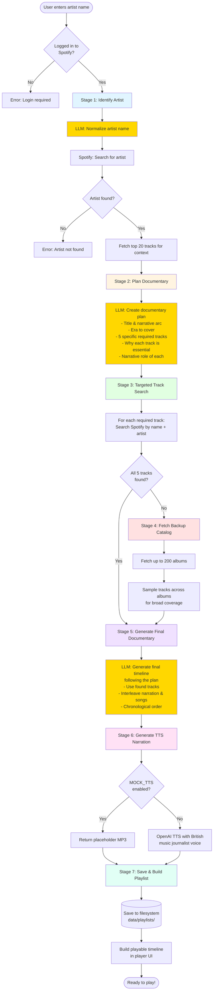

# Music Story (Spotify or YouTube)

**Transform any artist or music topic into an immersive audio documentary**

Music Story uses AI to generate compelling, professionally-narrated documentaries that blend historical context, artist insights, and cultural analysis with perfectly curated tracks. You can run the app in one of two exclusive modes: Spotify or YouTube.

Built with OpenAI for intelligent content generation and TTS narration, Spotify Web Playback SDK for Spotify mode, and the YouTube IFrame Player + Data API for YouTube mode.

## Features

- **AI-Powered Documentary Generation**: Enter any artist, band, or music topic and get an instant audio documentary with historical context, cultural insights, and 5 perfectly selected tracks
- **Professional AI Narration**: High-quality text-to-speech narration using OpenAI's latest models, with customizable voice and pacing
- **Exclusive Modes**: Choose Spotify or YouTube. The app behaves as a single-source player (no mixed playback), which keeps UX simple and predictable.
- **Seamless Spotify Integration**: Direct playback through Spotify Premium accounts using the Web Playback SDK
- **YouTube Mode (no Spotify required)**: Generate and play documentaries without Spotify login. Tracks are mapped to YouTube videos using the YouTube Data API.
- **Intelligent Track Selection**: AI analyzes artist catalogs to choose the most relevant songs that tell the story
- **Save & Share**: Persistent playlists with shareable links—generate once, listen anywhere
- **Real-Time Progress**: Live updates as your documentary is being created, from artist identification to narration generation
- **Beautiful UI**: Clean, responsive interface optimized for both desktop and mobile
- **Custom Credentials**: Use your own Spotify Developer app to bypass access restrictions
- **Mock Mode**: Development mode with placeholder audio to save API costs during testing

## Prerequisites

- Node.js (v14 or later)
- npm (comes with Node.js)
- A Spotify Premium account (Spotify mode only)
- A Spotify Developer account to create an application (Spotify mode only)
- A Google Cloud project with YouTube Data API v3 enabled (YouTube mode only)

## Setup

### 1. Create a Spotify Application

1. Go to the [Spotify Developer Dashboard](https://developer.spotify.com/dashboard/)
2. Log in with your Spotify account
3. Click "Create an App"
4. Fill in the following details:
   - App name: Spotify MP3 Mix Player
   - App description: A web player that mixes Spotify tracks with local MP3s
   - Website: http://localhost:8888
   - Redirect URI: http://localhost:8888/callback
5. Click "Save"
6. Note down your `Client ID` and `Client Secret` (click "Show Client Secret")

### 2. Configure Environment Variables

1. Rename the `.env.example` file to `.env`
2. Update the following variables in the `.env` file:
   ```env
   # Spotify
   CLIENT_ID=your_spotify_client_id
   CLIENT_SECRET=your_spotify_client_secret
   # Note: Redirect URI is automatically set to {current_origin}/callback

   # Server
   PORT=8888
   CLIENT_DEBUG=0     # set 1 for verbose client logs
   SERVER_DEBUG=0     # set 1 for verbose server logs

   # OpenAI
   OPENAI_API_KEY=your_openai_api_key
   OPENAI_TTS_MODEL=gpt-4o-mini-tts
   OPENAI_TTS_VOICE=alloy
   TTS_OUTPUT_DIR=public/tts

   # Development Features
   MOCK_TTS=0         # set 1 to use a local placeholder MP3 instead of OpenAI TTS

    # YouTube Data API v3 (YouTube mode only)
    # Create an API key in Google Cloud Console and restrict it to YouTube Data API v3
    YOUTUBE_API_KEY=your_youtube_data_api_key
   ```

### 3. Enable YouTube Data API v3 (for YouTube mode)

1. Go to Google Cloud Console → APIs & Services → Credentials
2. Create an API key (restrict it to the YouTube Data API v3)
3. Enable the API: APIs & Services → Library → "YouTube Data API v3"
4. Paste the key into `YOUTUBE_API_KEY` in `.env`

### 4. Install Dependencies

```bash
npm install
```

### 5. Add MP3 Files (optional)

1. Create a directory called `public/audio` in your project root
2. Add your MP3 files to this directory
3. Update the `setupDefaultPlaylist()` function in `public/player.js` to include your MP3 files

### 6. Start the Server

```bash
npm run dev
```

This runs the modular server (`src/server.js`) with nodemon and serves `public/`.

### 7. Access the Application

Open your web browser and navigate to:

```
http://localhost:8888
```

## How to Use

### Pick a Mode

- Spotify mode: visit `http://localhost:8888/?mode=spotify` (you’ll be redirected to `player.html` and prompted to login)
- YouTube mode: visit `http://localhost:8888/?mode=youtube` (no Spotify login required)

The mode is exclusive and drives routing, SDK loading, generation flow, and UI visibility.

#### Spotify mode flow
1. Go to `http://localhost:8888/?mode=spotify` and click "Login with Spotify Premium" on `player.html`.
2. Authorize the app; the player initializes and transfers playback to this device.
3. Generate a documentary by entering a topic and clicking "Generate Outline".
4. The app uses a **multi-stage intelligent workflow** (see flow diagram below).
   - **Stage 1**: Identifies the artist using LLM normalization + Spotify search
   - **Stage 2**: LLM plans the documentary, choosing 5 specific tracks with narrative justification
   - **Stage 3**: Searches Spotify for those exact tracks
   - **Stage 4**: Fetches backup catalog if any tracks are missing
   - **Stage 5**: LLM generates final timeline following the plan
   - **Stage 6**: Generates TTS narration with British music journalist voice (or mock mode)
   - **Stage 7**: Saves playlist and builds playable timeline
5. Use controls to play/pause/seek. The UI shows status updates during generation.
6. Click "Refresh" under "My Playlists" to see saved documentary items. Use "Share" to copy a shareable link.

#### YouTube mode flow (no Spotify)

1. Go to `http://localhost:8888/?mode=youtube`.
2. Enter a topic and click "Generate Outline". The server uses OpenAI to generate the timeline without Spotify.
3. The client maps song entries to YouTube using `/api/youtube-map-tracks` and plays via the YouTube IFrame player.
4. Playlists are saved with `source: "youtube"` and `ownerId: "anonymous"` by default.

You can import a saved playlist via the "Import by ID" button. The URL includes `?playlistId=...` for refresh persistence.

## Documentary Generation Flow

The app uses an intelligent multi-stage workflow where the LLM plans the documentary narrative first, then we fetch the specific tracks it needs:



### Example: The Prodigy

**Stage 2 Plan Output**:

```json
{
  "title": "The Prodigy: Rave to Riot",
  "narrative_arc": "From underground rave pioneers to mainstream crossover...",
  "era_covered": "1992-1997",
  "required_tracks": [
    {
      "song_title": "Charly",
      "approximate_year": "1992",
      "why_essential": "Breakthrough rave anthem that defined early sound",
      "narrative_role": "Origins - underground rave scene"
    },
    {
      "song_title": "Firestarter",
      "approximate_year": "1996",
      "why_essential": "Mainstream crossover moment, controversial punk-rave fusion",
      "narrative_role": "Peak - commercial breakthrough"
    }
    // ... 3 more tracks
  ]
}
```

**Stage 3**: Searches Spotify for "Charly", "Firestarter", etc. by name

**Stage 5**: Generates final documentary using those exact tracks with proper context

## Customizing the Default Playlist

To customize the playlist, edit the `setupDefaultPlaylist()` function in `public/player.js`. You can add Spotify tracks or local MP3 files to the playlist.

### Keyboard Shortcuts

- **Space**: Play/Pause
- **Ctrl + →**: Next track
- **Ctrl + ←**: Previous track
- **Ctrl + ↑**: Increase volume
- **Ctrl + ↓**: Decrease volume

## Troubleshooting

- **OAuth “User not registered in the Developer Dashboard”**: Add your account as a user in your Spotify app’s settings.
- **Playback issues**: Ensure Premium is active; verify Web Playback SDK initialized and device playback was transferred.
- **CORS**: Serve from `http://localhost:8888` to match the redirect URI.
- **Outline button doesn’t respond**: In YouTube mode, the controls are on `/` (index). In Spotify mode, they’re on `/player.html`.
- **TTS costs/time during development**: Set `MOCK_TTS=1` to use a bundled local MP3 for narration.

## Design Notes (Exclusive Modes)

- **Routing**
  - `/` with `?mode=spotify` → redirects to `/player.html?mode=spotify`
  - `/` with `?mode=youtube` → stays on index; YouTube player and generation controls visible
- **SDK Loading**
  - Index only loads YouTube IFrame API
  - Player page only loads Spotify Web Playback SDK
- **Persistence**
  - Playlists saved to `data/playlists/*.json`
  - Each record includes `source: "spotify" | "youtube"`
  - YouTube mappings are embedded on each `song` item as `youtube: { videoId, title, channelId, durationSec, matchedConfidence }`
- **Owners**
  - Spotify mode lists by real Spotify user ID
  - YouTube mode lists by `ownerId: "anonymous"` (shared). You can switch to a per-browser UUID if you prefer isolation.

---

## Environment Variables Reference

- `CLIENT_ID`, `CLIENT_SECRET` - Spotify OAuth credentials (redirect URI is auto-calculated)
- `PORT` - Server port (default: 8888)
- `CLIENT_DEBUG`, `SERVER_DEBUG` - Enable verbose logging
- `OPENAI_API_KEY` - OpenAI API key for LLM and TTS
- `OPENAI_TTS_MODEL` - TTS model (default: gpt-4o-mini-tts)
- `OPENAI_TTS_VOICE` - Voice selection (alloy, echo, fable, onyx, nova, shimmer)
- `OPENAI_TTS_SPEED` - Playback speed 0.25-4.0 (default: 1.0, recommended: 1.25 for dynamic delivery)
- `TTS_OUTPUT_DIR` - Where to save generated MP3s
- `MOCK_TTS` - Set to 1 to use placeholder MP3s instead of OpenAI (saves costs during development)

---

## Development Notes

- Run in dev with nodemon: `npm run dev` (uses `src/server.js`).
- The client’s `DEBUG` mode is toggled from the server via `/config.js` and `CLIENT_DEBUG`.
- The Generate Outline button shows an inline spinner while work is in progress.
- If you need to use the single-file root server (`server.js`), change `package.json` scripts to point to it.

## License

This project is open source and available under the [MIT License](LICENSE).

## Acknowledgements

- [Spotify Web API](https://developer.spotify.com/documentation/web-api/)
- [Spotify Web Playback SDK](https://developer.spotify.com/documentation/web-playback-sdk/)
- [Web Audio API](https://developer.mozilla.org/en-US/docs/Web/API/Web_Audio_API)
- [OpenAI Responses + TTS](https://platform.openai.com/docs)
